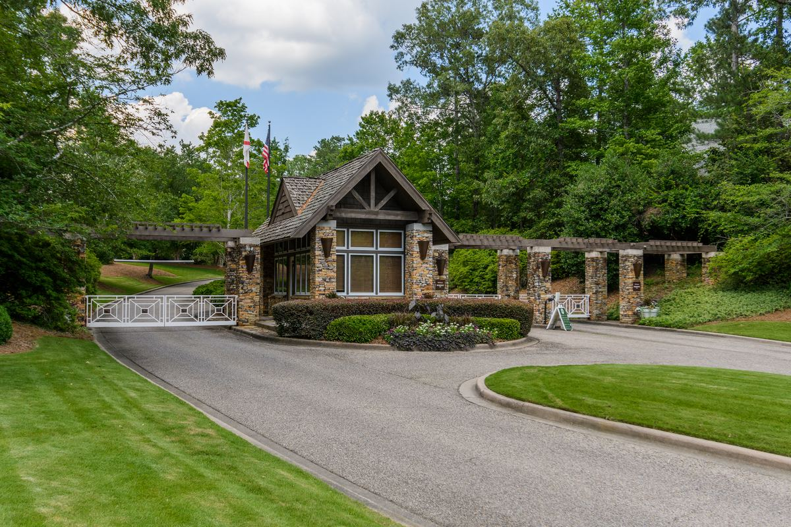
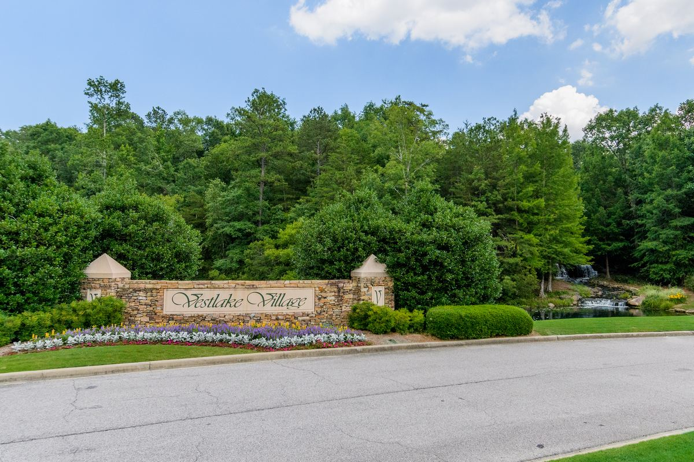

# Communities

Each community in Birmingham has its unique advantages. These are the neighborhoods Michelle knows door by door.

## Vestavia Hills & Liberty Park

[Master-Planned · Vestavia Hills](liberty-park.html)

### [Liberty Park](liberty-park.html)

[20 minutes from downtown, two Vestavia Hills City Schools inside the community, and 20 more years of planned growth.](liberty-park.html)

[8](liberty-park.html)[Active](liberty-park.html)[Gated · Golf Club](liberty-park.html#old-overton)

### [Old Overton](liberty-park.html#old-overton)

[Gated estates surrounding the Old Overton Club’s championship golf course. 17 new homesites released July 2026.](liberty-park.html#old-overton)

[2](liberty-park.html#old-overton)[Homesites](liberty-park.html#old-overton)[$2.45M](liberty-park.html#old-overton)[Top Sale](liberty-park.html#old-overton) [New Town Center](liberty-park.html#the-bray)

### [The Bray](liberty-park.html#the-bray)

[Liberty Park’s new heart — condos from the low $500s, townhomes, shops, the Great Lawn, and Livano apartments.](liberty-park.html#the-bray)

[2](liberty-park.html#the-bray)[Active](liberty-park.html#the-bray)[Low $500s](liberty-park.html#the-bray)[From](liberty-park.html#the-bray) [Family Neighborhoods](liberty-park.html#vestlake)

### [Vestlake](liberty-park.html#vestlake)

[Established family neighborhoods with lakes, pools, and quick access to both Liberty Park schools.](liberty-park.html#vestlake)

## Listing data disclaimer

Listing data on this site comes from the Internet Data Exchange (IDX) program of Greater Alabama MLS. IDX information is provided exclusively for personal, non-commercial use, and may not be used for any purpose other than to identify prospective properties consumers may be interested in purchasing. Information is deemed reliable but not guaranteed. Listings held by brokerage firms other than ARC Realty are marked with the name of the listing broker. All contents copyright © 2026 Greater Alabama MLS. All rights reserved.
