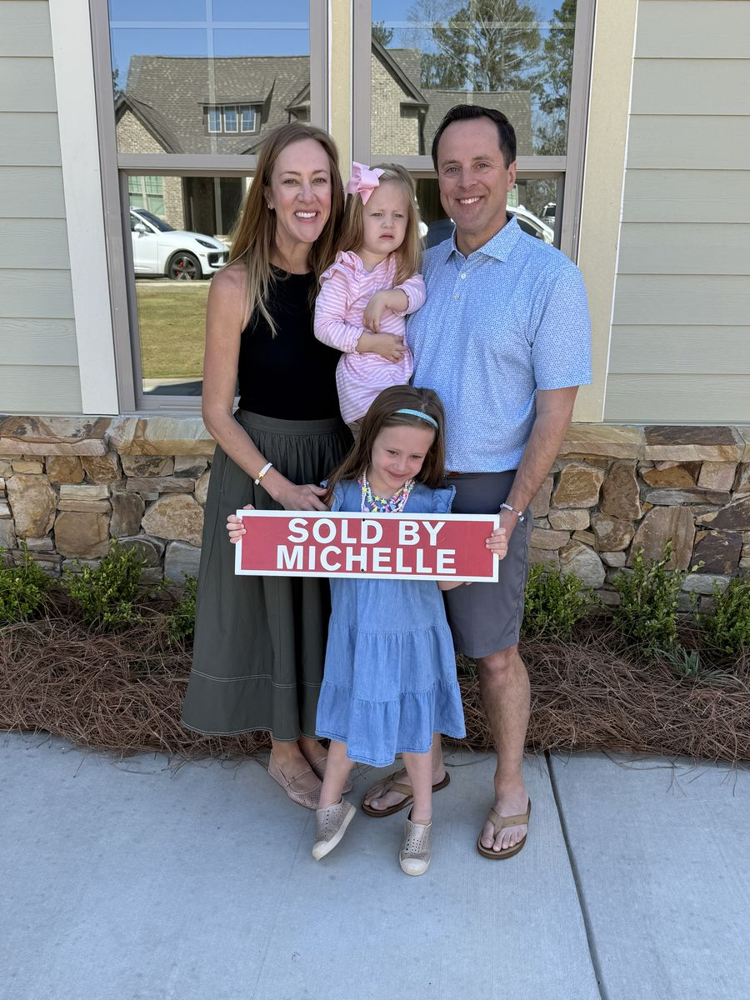
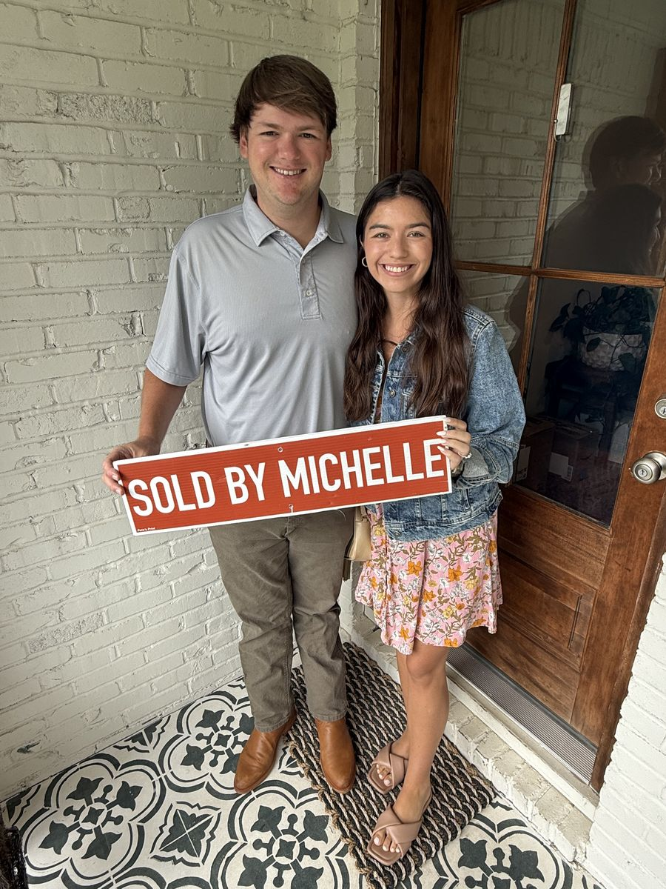
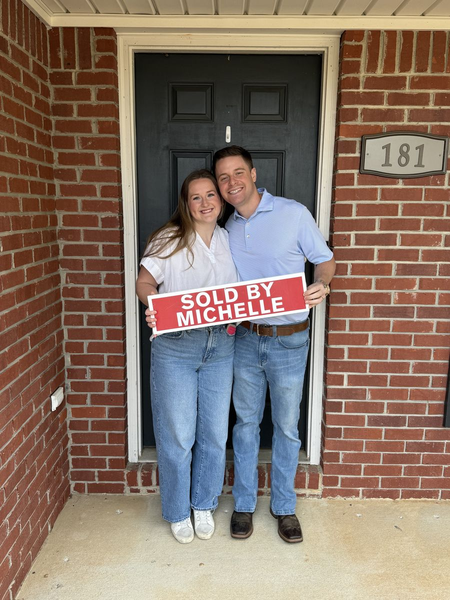

# Home Buying Guide

Everything you need to know before you buy — how agency works, what your agent actually does, and the checklists that keep the process calm.

## How does working with an agent work?

As a buyer, you can work with a licensed agent through every stage of the purchase — from prequalification, to finding the right home, to writing the offer, negotiating, and closing. Many sellers offer a cooperating compensation to the buyer’s agent, which is typically paid by the seller as part of the closing costs, usually calculated as a percentage of the sale price.

## What does a buyer’s agent do?

- Conduct a needs analysis to ensure fiduciary service

- Help you get pre-qualified with a mortgage lender

- Research and identify homes that meet your criteria

- Schedule showings of homes with listing agents and sellers

- Go on a home tour with you and show homes

- Refine your criteria and select more homes to show as needed

- Write and submit offers to purchase homes

- Negotiate all offers to purchase and oversee the negotiation process

- Schedule and attend home inspections with you and the inspector

- Negotiate all inspection repairs

- Provide access to the home as needed for measuring, inspecting, and more

- Educate and guide you through the process, all the way to closing

- Provide community, pricing, and market information

- Promptly return all calls, texts, and emails from all parties involved

## What is a buyer’s agency agreement?

A buyer’s agency agreement is a formal contract stating that you will work exclusively with one agent through your purchase. It protects the agent — who is only compensated at closing — and it keeps the transaction fair to all parties involved. It also formalizes your agent’s fiduciary duty to you: your interests come first, full stop.

## Getting started — define your needs & wants

Almost every home purchase involves some degree of compromise. Before you tour a single house, rate what matters to you on a scale of 1–10 — school zones, commute, yard, kitchen, square footage, walkability. Knowing your non-negotiables keeps you from falling for the wrong house.

## Recent closings

## Listing data disclaimer

Listing data on this site comes from the Internet Data Exchange (IDX) program of Greater Alabama MLS. IDX information is provided exclusively for personal, non-commercial use, and may not be used for any purpose other than to identify prospective properties consumers may be interested in purchasing. Information is deemed reliable but not guaranteed. Listings held by brokerage firms other than ARC Realty are marked with the name of the listing broker. All contents copyright © 2026 Greater Alabama MLS. All rights reserved.
