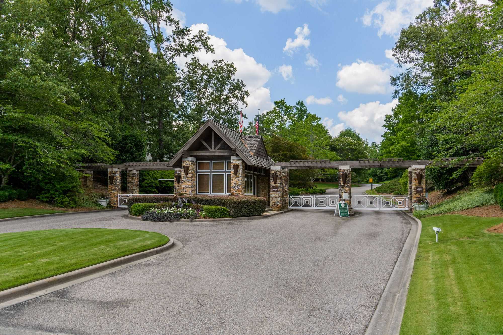
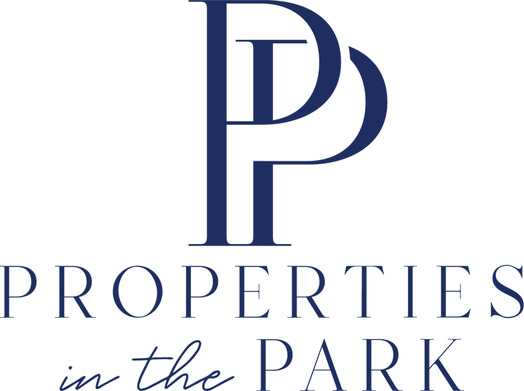
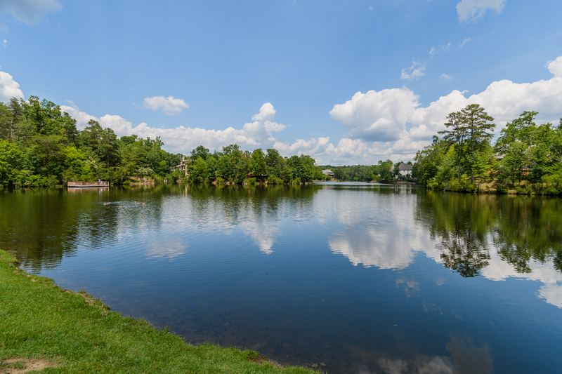
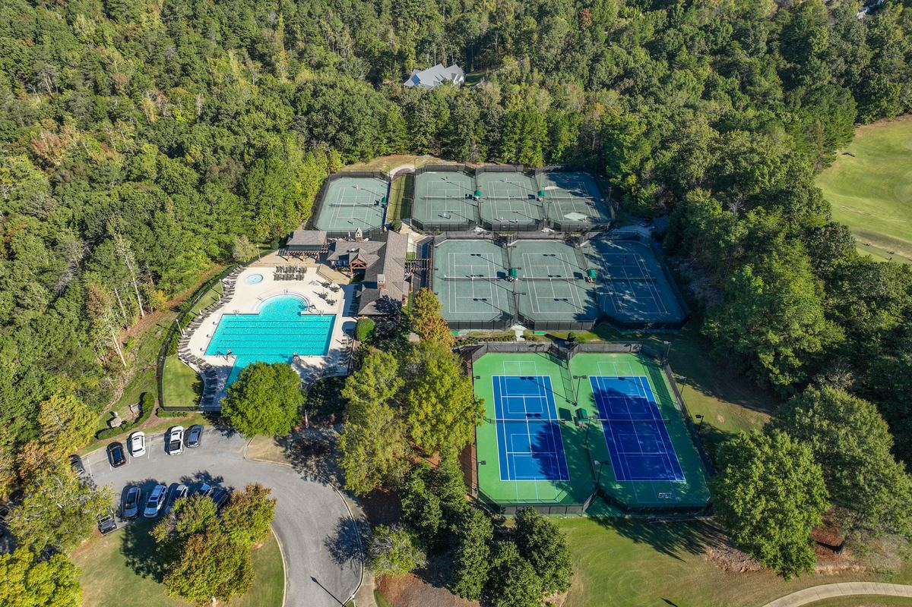
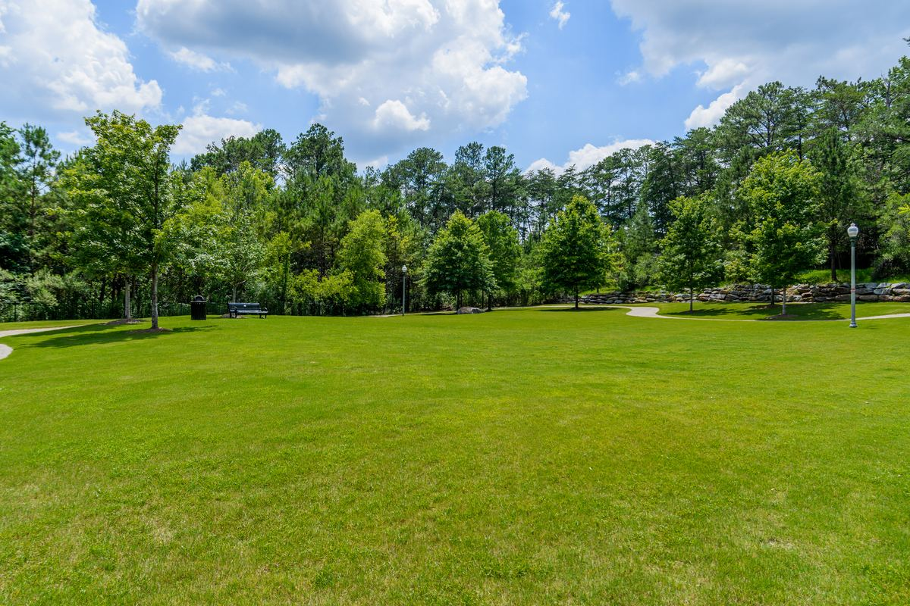
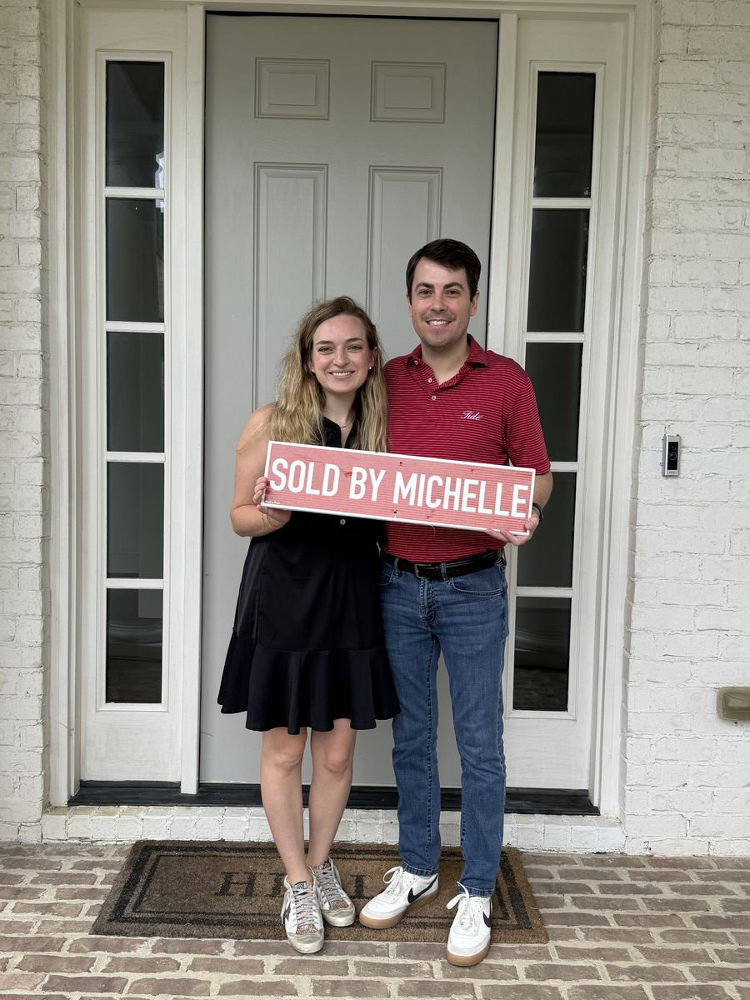
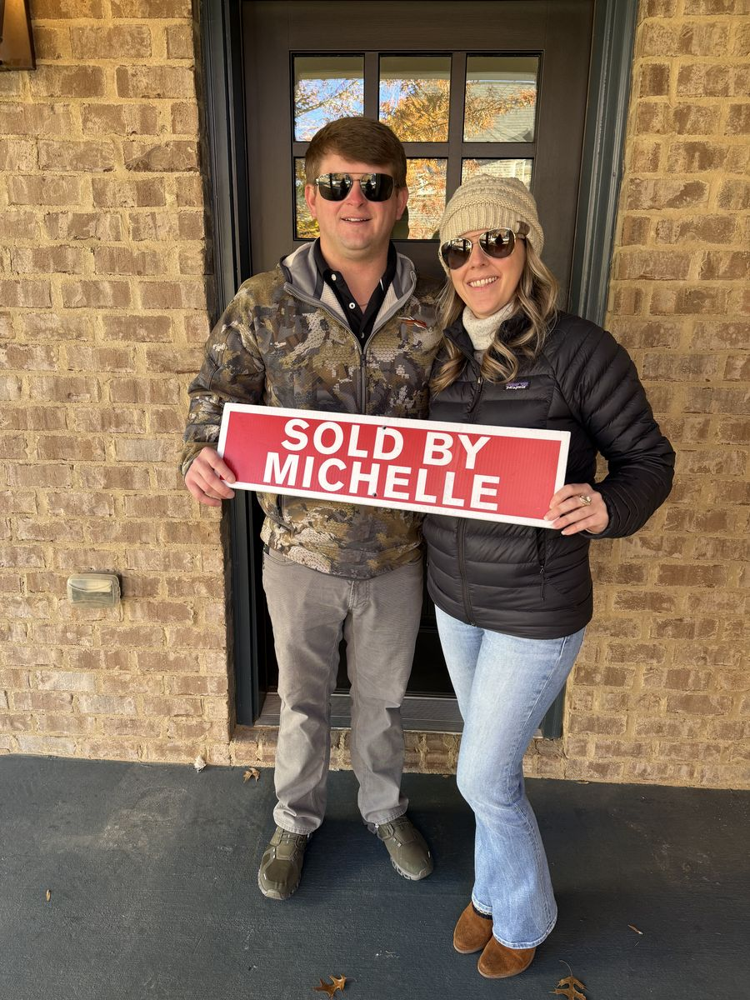
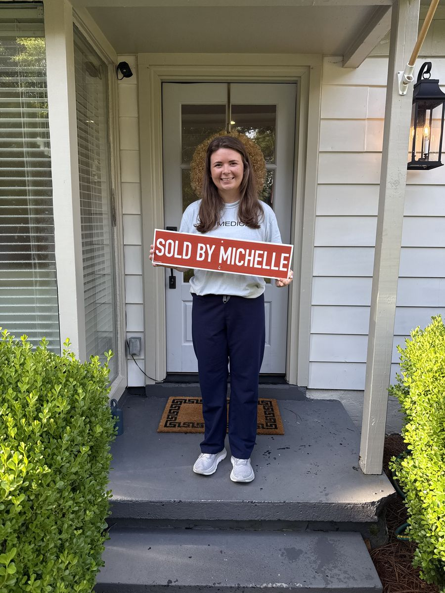
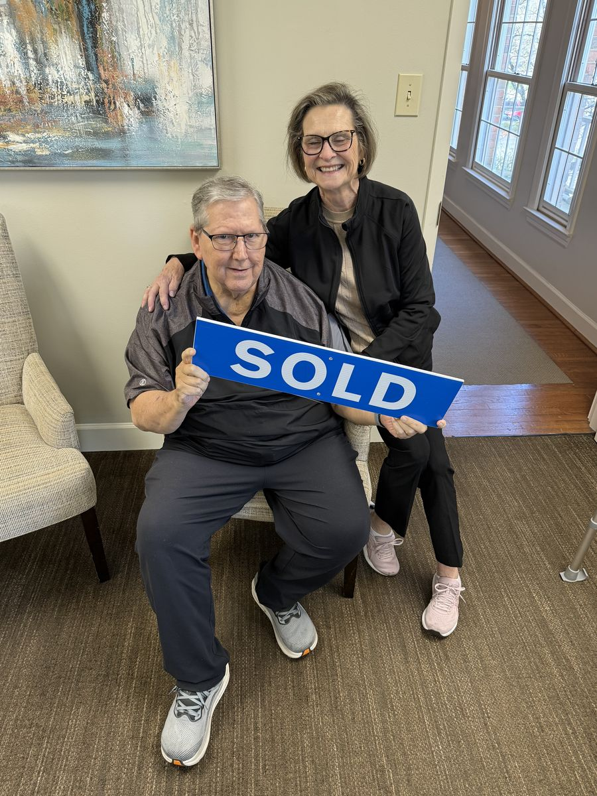
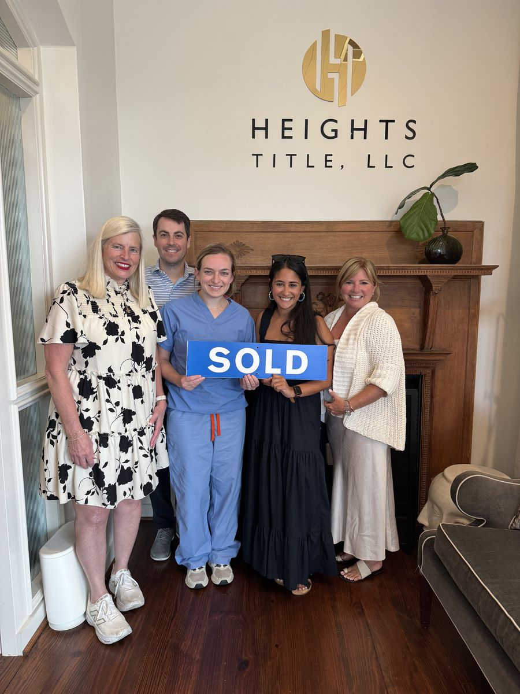

# Your Pathway Home

Michelle Creamer is the #1 sales agent in Vestavia Hills and Liberty Park — a Liberty Park resident of 20+ years who has guided her neighbors home since 2002.

#1 Sales Agent · Vestavia Hills

## Michelle Creamer

Realtor® / Associate Broker · License #70777

Michelle Creamer has been a licensed realtor in Alabama since 2002. She has a B.S. degree from Jacksonville State University and spent 20 years working in development with a Birmingham-based non-profit, where she assisted with purchasing and selling homes appropriate for adults with physical and mental disabilities.

Since 2014, Michelle has become one of Birmingham’s highest-producing realtors and has led sales in the Liberty Park community for years — with a record-breaking $60 million sold in 2024, $49.5 million of it in Vestavia Hills. She has lived in Liberty Park for more than 20 years with her husband and two children, so she knows this market house by house. In her spare time, Michelle loves her two rescue dogs, Poppy and Chewie.

☏ (205) 999-8164 Mobile ☏ (205) 730-2359 Office [✉ Email Me](contact-me.html) [f](https://www.facebook.com/michelle.creamer.96) [in](https://www.linkedin.com/in/michelle-creamer-71bbba43) [Z](http://www.zillow.com/profile/mcreamer1/)

### Get an instant home value estimate

Find out what your Liberty Park or Vestavia Hills home is worth in today’s market — free, with no obligation.

## Featured Listings

Michelle’s current portfolio across Liberty Park, Vestavia Hills, and greater Birmingham.

$60M — Sold in 2024 alone $49.5M — Sold in Vestavia Hills 2002 — Licensed in Alabama 100+ — Homes closed in Liberty Park

## Recently Sold

A sample of Michelle’s closed sales — from $479K family homes to $2.45M estates.

## Your Pathway to the Perfect Home

The ARC Realty Home Search is your go-to tool for exploring homes across Alabama. Register to view detailed listings, check commute times, review neighborhoods, and message Michelle instantly to ask questions or schedule a tour.

$729,900

## Where Michelle Sells

Neighborhood expertise you can only get from someone who lives here.

[Birmingham · Vestavia Hills](liberty-park.html)

### [Liberty Park](liberty-park.html)

[The master-planned community Michelle has called home for 20+ years.](liberty-park.html)

[8](liberty-park.html)[Active Listings](liberty-park.html)[2](liberty-park.html)[Open Houses](liberty-park.html) [Gated · Golf](liberty-park.html#old-overton)

### [Old Overton](liberty-park.html#old-overton)

[Gated estates around the Old Overton Club — 17 new homesites just released.](liberty-park.html#old-overton)

[2](liberty-park.html#old-overton)[Homesites](liberty-park.html#old-overton)[$2.45M](liberty-park.html#old-overton)[Top Sale](liberty-park.html#old-overton) [New Construction](liberty-park.html#the-bray)

### [The Bray](liberty-park.html#the-bray)

[Liberty Park’s new town center — condos and townhomes from the low $500s.](liberty-park.html#the-bray)

[2](liberty-park.html#the-bray)[Active](liberty-park.html#the-bray)[2026](liberty-park.html#the-bray)[Phase](liberty-park.html#the-bray) [View all communities](communities.html)

## The best part of the job

A few of the people who trusted Michelle with the biggest move of their year.

## 5.0 ★ from 70 client reviews

Real words from real closings.

★★★★★

> “We could not have asked for more than what Michelle Creamer provided in the selling of our home. She was so responsive and extremely knowledgeable. She truly has a passion for her work and I would highly recommend her.”

— Home Seller, Vestavia Hills ★★★★★

> “She walked me through each step of the selling process and was able to help me get multiple offers over asking within a day of listing!”

— Home Seller, Liberty Park ★★★★★

> “Michelle took care of every detail for selling and buying our home. Our home we were selling sold in 2 days with multiple offers. 100% recommend using Michelle Creamer for your real estate needs.”

## Listing data disclaimer

Listing data on this site comes from the Internet Data Exchange (IDX) program of Greater Alabama MLS. IDX information is provided exclusively for personal, non-commercial use, and may not be used for any purpose other than to identify prospective properties consumers may be interested in purchasing. Information is deemed reliable but not guaranteed. Listings held by brokerage firms other than ARC Realty are marked with the name of the listing broker. All contents copyright © 2026 Greater Alabama MLS. All rights reserved.
