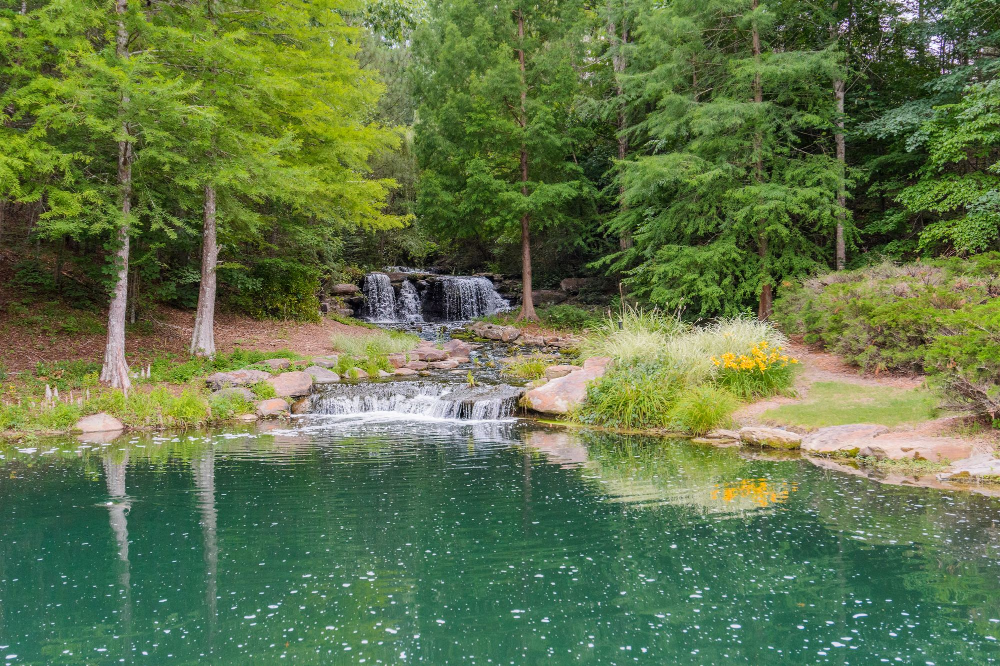
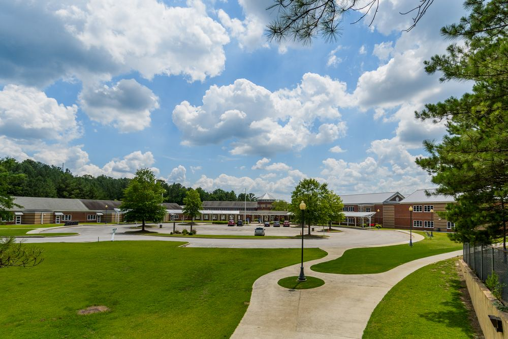
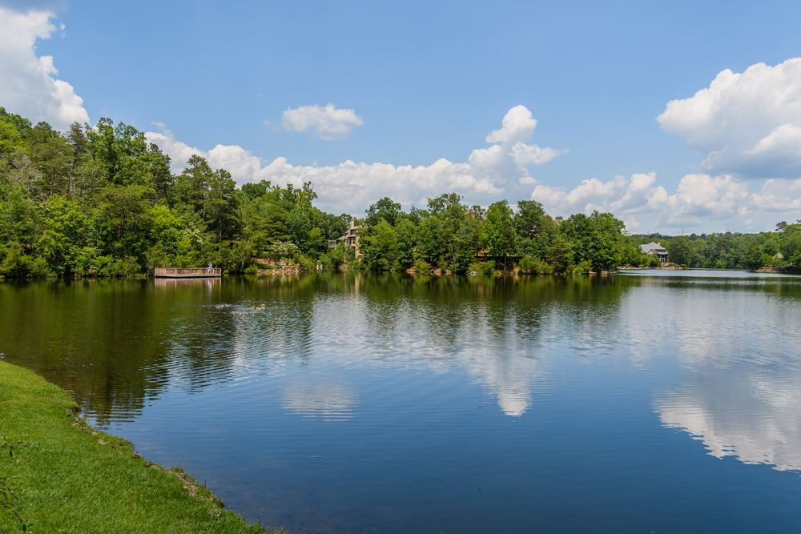
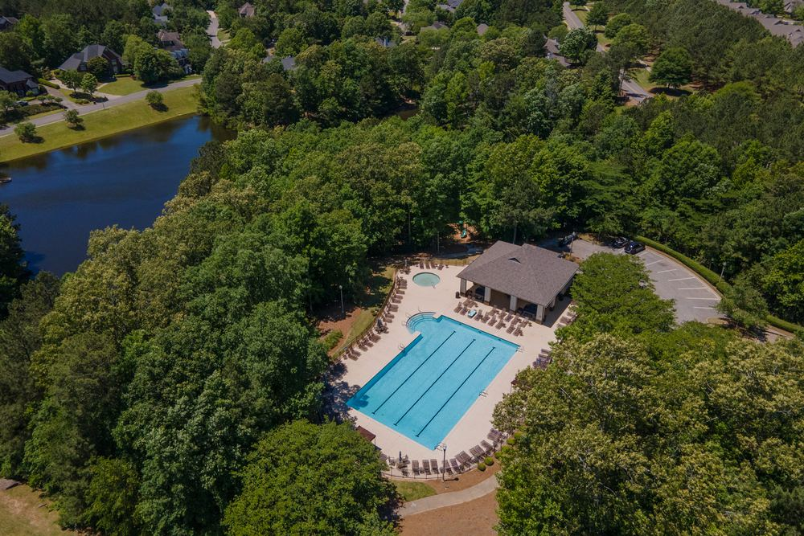
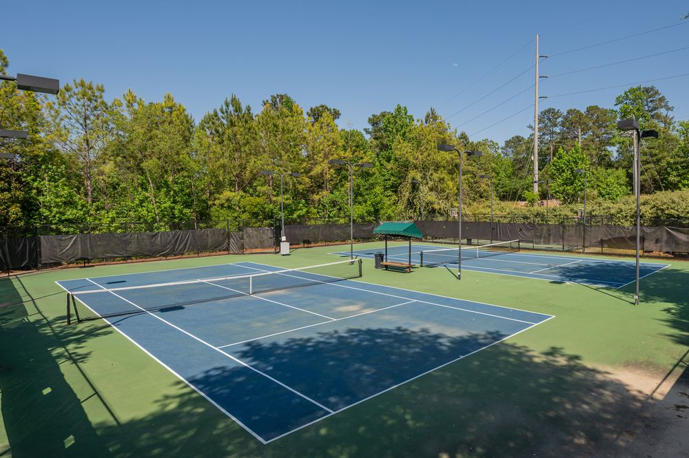
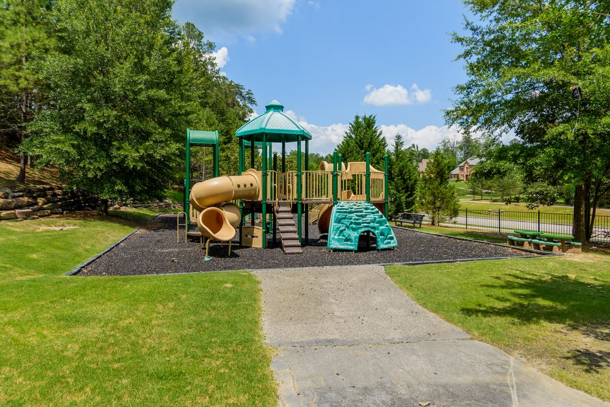
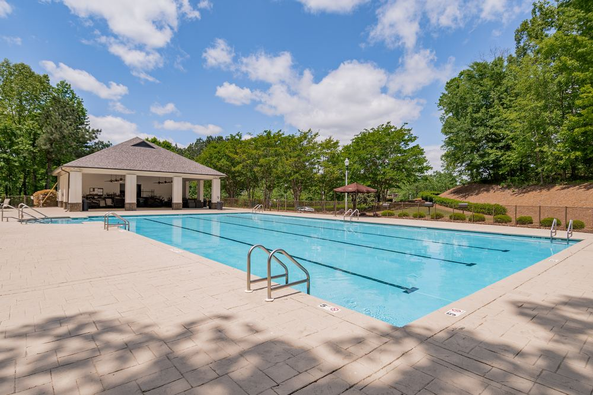
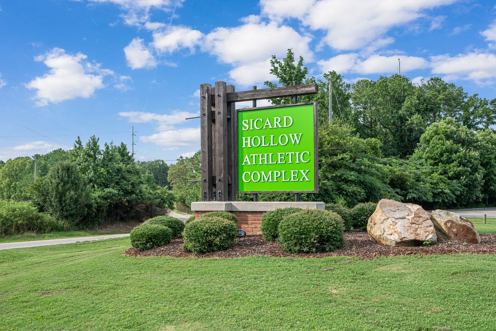
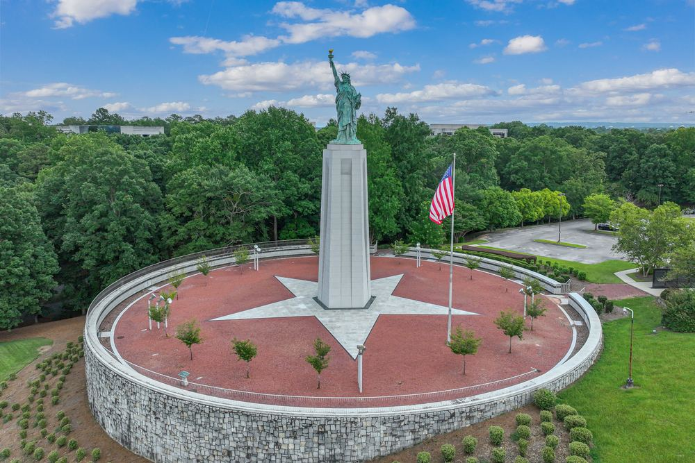

# Liberty Park

A master-planned community 20 minutes from downtown Birmingham — established for 20+ years with 20 more years of planned growth ahead. Michelle doesn’t just sell Liberty Park; she’s lived here for two decades.

## Life in Liberty Park

Liberty Park offers a housing mix that spans every stage of life — from townhouses and garden homes to custom builds and large lake homes. In The Bray, condos and townhomes start in the low $500s with single-family homes to the low $800s; in Old Overton, gated estates have closed as high as $2.45M.

The community is zoned to Vestavia Hills City Schools, with two schools inside Liberty Park itself: Vestavia Hills Elementary Liberty Park and Liberty Park Middle. This mirror does not restate third-party school rankings, because the source page does not name the ranking body or the year. For school ratings, ask Vestavia Hills City Schools directly.

### Old Overton

Gated estates surround the Old Overton Club and its championship golf course designed by Tom Fazio and Jerry Pate. Seventeen new homesites were released in July 2026 — a rare chance to build inside the gates.

### The Bray

Liberty Park’s new town center brings walkable life to the community: Harris Doyle homes, the Livano apartments, The Filmont hotel, shops, restaurants, and the Great Lawn for community events.

### Vestlake

The established heart of Liberty Park — family neighborhoods built around lakes, pools, and swim clubs, minutes from both community schools.

## Liberty Park, in Photos

Zoned Vestavia Hills City Schools — two schools inside the community Vestlake’s lakes, woven through the neighborhoods Swim clubs and neighborhood pools Tennis just minutes from home Parks and playgrounds throughout the community Neighborhood pools across Vestlake Sicard Hollow Athletic Complex The Liberty statue — the landmark that gives the area its name Michelle — your resident guide for 20+ years 20 min — To downtown Birmingham 18 — Championship golf holes 20 yrs — Of planned growth ahead

## Homes in & around Liberty Park

## Recent closings

## Listing data disclaimer

Listing data on this site comes from the Internet Data Exchange (IDX) program of Greater Alabama MLS. IDX information is provided exclusively for personal, non-commercial use, and may not be used for any purpose other than to identify prospective properties consumers may be interested in purchasing. Information is deemed reliable but not guaranteed. Listings held by brokerage firms other than ARC Realty are marked with the name of the listing broker. All contents copyright © 2026 Greater Alabama MLS. All rights reserved.
