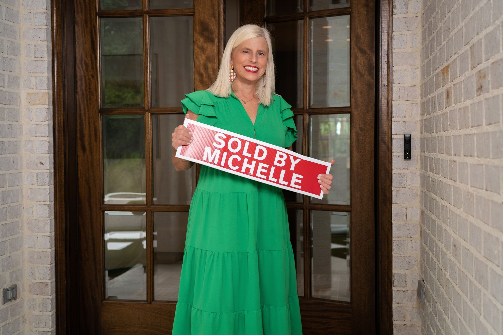

# Marketing Your Home

A yard sign is barely the tip of the iceberg. With the newest technology and tried-and-true best practices, ARC agents sold homes $40,000 more and 8 days faster than the market average.

## Seven steps to sold

01

### Price Setting

The right price is the most important marketing tool for any listing. Homes that are priced too high will spend significantly longer on the market, which can force your price down as well. Market price is determined by far more than your original buying price, square footage, updates, or location. Michelle studies the market to help you find a price based on all factors — one that will hopefully bring in multiple offers, so your home is sold quickly at a competitive price.

02

### Prepping for Sale

You only get one chance to make a first impression. From general curb appeal to decluttering, painting, and staging, Michelle will guide you to a cost-effective strategy that brings the best return on your efforts and investment.

03

### Professional Photography

Before a potential buyer sets foot in your house, they have already viewed it online and made a handful of judgments. Strong photography goes a long way in establishing good emotions, driving showings, and getting people excited. Michelle arranges photography that shows your house in its best light — used across every physical and digital marketing piece.

04

### Marketing Collateral

As soon as your listing goes live, you get a professional series of marketing collateral: flyers, postcards, and social media posts. Listing collateral gives your home a clean, consistent, professional presence in front of every buyer who sees it.

05

### Digital Distribution

ARC’s website syndication is unrivaled in the market. Your listing gets a dedicated page on the ARC site and is distributed through more than 750 websites — including Zillow, Realtor.com, and Trulia.

06

### Agent Outreach

As one of the largest real estate brokerages in the state, ARC puts your home in front of the agents who matter. Through eblasts to Realtors, sales and market meetings, caravans, and agent open houses, your listing’s reach expands far beyond the public portals.

07

### We’re Local, We’re Global

ARC is a proud member of Leading Real Estate Companies of the World — the top 5% of independently owned real estate brokerages. Supported by an internal team of relocation specialists, this affiliation provides an immediate network of incoming relocation referrals from around the country and the world.

## Recent closings

## Listing data disclaimer

Listing data on this site comes from the Internet Data Exchange (IDX) program of Greater Alabama MLS. IDX information is provided exclusively for personal, non-commercial use, and may not be used for any purpose other than to identify prospective properties consumers may be interested in purchasing. Information is deemed reliable but not guaranteed. Listings held by brokerage firms other than ARC Realty are marked with the name of the listing broker. All contents copyright © 2026 Greater Alabama MLS. All rights reserved.
